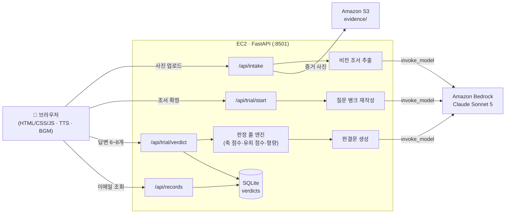

# ⚖️ 소비 재판소

> "이거… 내가 왜 샀지?"

후회되는 소비의 **사진 한 장을 '기소'**하면 AI 판사가 심문하고 **유·무죄를 선고**하는 웹 법정.
재판 과정에서 자신의 소비를 회고하고, **소비 유형(16종)**과 **절약 미션(형량)**을 받는다.

**🔗 라이브 데모: http://18.135.105.80:8501**

2026 제2회 호남권 SW중심대학 LLM 해커톤 (AWS × Kiro) — 팀 **E1-T07**

---

## 재판 절차

| 단계 | 화면 | 내용 |
|---|---|---|
| 1 | **소환장** | 이메일만으로 피고인 출석 (비밀번호 없음) |
| 2 | **기소** | 결제내역 캡처·영수증·제품 사진 1장 제출 → Bedrock 비전이 조서 작성. 거래가 여러 건이면 기소할 건을 선택 |
| 3 | **조서 확인** | 추출 결과를 수정 가능한 카드로 확인 — "이 물건이 맞소?" |
| 4 | **심문** | 판사가 6~8개 질문을 하나씩. 질문 문구는 Bedrock이 사건 맞춤 재작성, 판사 음성은 브라우저 TTS. 답할 때마다 심증 게이지가 차오른다 |
| 5 | **판결** | BGM이 멎고 판사봉 소리 → 도장(유죄/집행유예/무죄) → 소비 유형 캐릭터 카드 → 판결문(죄명·주요 증거·재판부 판단·최종 판결) → 형량(절약 미션) |
| 6 | **전과 기록** | 판결받은 소비들의 회고 아카이브 — 당시 심문 문답·판결문 재열람 |

## 아키텍처



## 설계 원칙 — "판정은 룰, 문장은 LLM"

- **판정(유·무죄, 16유형, 형량)은 전부 서버의 결정적 룰**이 내린다 — 재현 가능하고 조작 불가능한 판결.
  질문 뱅크의 선택지마다 축(pole)·유죄(guilt) 점수가 서버에 박혀 있고, 판결 시 서버가 원본 태그로 재채점한다.
- **LLM(Bedrock Claude Sonnet 5)은 3곳에서 문장만 쓴다**: ①사진→조서 추출(비전) ②질문을 그 물건 맞춤으로 재작성 ③죄명·재판부 판단 생성.
- **LLM이 전부 실패해도 재판은 끝까지 간다** — 기본 질문 뱅크와 템플릿 판결문 폴백. 실측된 Bedrock 함정(thinking 블록, 파라미터 거부, 응답 잘림)은 전부 `.kiro/steering/tech-constraints.md`에 규칙화돼 있다.
- 추정이 들어가는 값은 화면에 근거를 명시한다 — 예: "회당 단가 (가끔 사용 → 3회 가정)".

## 기술 스택

- **Frontend**: 순수 HTML/CSS/JS (프레임워크 없음) · Web Speech TTS · Web Audio/BGM · 스펙큘레이티브 프리페치(조서 읽는 동안 심문 준비 → 로딩 체감 0)
- **Backend**: FastAPI + SQLite · 응답 봉투 규약 · 422→400 전역 변환
- **AI**: Amazon Bedrock `global.anthropic.claude-sonnet-5` (비전+텍스트, invoke_model)
- **Infra**: EC2(Ubuntu 24.04) + S3 presigned URL
- **아트**: 전부 자체 제작 SVG(법정·돼지 판사·도장·유형 캐릭터 19종) — 외부 에셋 0

## Kiro 활용

- **Steering 4장**(`.kiro/steering/`) — 제품 정의·기술 제약·구조·API 계약을 상시 주입. 실측으로 당한 함정을 규칙으로 적어 재발 방지
- **Specs** — 설계 문서(`docs/` 판정 룰표·프롬프트·API 계약)를 백엔드 9개·프론트 10개 태스크로 분해(`kiro-prompts/`), 한 번에 하나씩·완료 기준 명시
- **Hooks**(`.kiro/hooks/`) — 백엔드 파일 저장 시 pytest 자동 실행. 판정 룰 테스트가 룰표 숫자에 잠겨 있어 판정 변조를 저장 즉시 잡는다
- **사람 검수 루프** — 태스크마다 코드 리뷰+테스트+실기기 확인 후 커밋, 잡은 실수는 Steering으로 환류

## 실행

```bash
# 로컬 (LLM은 MOCK)
pip install -r requirements.txt
MOCK_AI=1 python -m uvicorn main:app --port 8501
# 시드(데모 전과 5건)
MOCK_AI=1 python -m data.seed
# 테스트
MOCK_AI=1 python -m pytest tests/ -q
```

서버 배포·검증 절차는 [docs/99-작업순서.md](docs/99-작업순서.md) 참고.

## 프로젝트 구조

```
main.py              # FastAPI 진입점 · 응답 봉투 · 422→400 · 정적 서빙
constants.py         # 판정 룰 단일 출처 (질문 뱅크·16유형·점수표)
services/            # llm(Bedrock)·intake(비전)·trial(룰)·verdict(판결)
routes/              # /api/intake · /api/trial/* · /api/records
static/              # SPA 프론트 + 자체 제작 SVG 아트
docs/                # 판정 룰표 · LLM 프롬프트 · 작업 순서 (설계 원본)
.kiro/               # steering 4장 + hooks
kiro-prompts/        # Kiro 태스크 프롬프트 19종 (협업 기록)
```

## 팀

| 이름 | 역할 |
|---|---|
| 김성규 | 백엔드 메인 |
| 김태현 | 백엔드 보조 · 발표 |
| 박진수 | 기획 · 인프라 구축 |
| 손경빈 | 프론트엔드 메인 |
| 이윤서 | 프론트엔드 보조 |

## 출처

- 소비 유형 분류: 소비 MBTI 16 — MPiA (blog.naver.com/ezpbill), 유형명은 팀 단축판
- BGM "The Weighted Scale": AI 생성 (Google Gemini)
- 일러스트(법정·판사·유형 캐릭터): 팀 자체 제작 SVG
